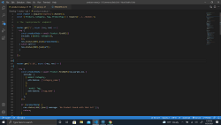

# E-Commerce Back End

## Description

This is a back end program for an Internet retail, also known as **e-commerce**, which is the largest sector of the electronics industry. The task is to build the back end for an e-commerce site where it utilizes the CRUD operations. Create, Read, Update and Delete items from the MySql data base using an ORM called Sequalize. 


## User Story

AS A manager at an internet retail company
I WANT a back end for my e-commerce website that uses the latest technologies
SO THAT my company can compete with other e-commerce companies


## Acceptance Criteria

```md
GIVEN a functional Express.js API
WHEN I add my database name, MySQL username, and MySQL password to an environment variable file
THEN I am able to connect to a database using Sequelize
WHEN I enter schema and seed commands
THEN a development database is created and is seeded with test data
WHEN I enter the command to invoke the application
THEN my server is started and the Sequelize models are synced to the MySQL database
WHEN I open API GET routes in Insomnia Core for categories, products, or tags
THEN the data for each of these routes is displayed in a formatted JSON
WHEN I test API POST, PUT, and DELETE routes in Insomnia Core
THEN I am able to successfully create, update, and delete data in my database
```


## Table

- [Installation](#installation)
- [Screenshot Video link](#screenshot-video-link)
- [Deployment](#deployment)
- [Repository](#repository)
- [Credits](#credits)
- [Future Development](#future-development)
- [License](#license)


## Installation

Once pulled over from gitHub onto your local machine.
- First is to open up Microsoft Visual Studio Code.
    
- Then over on the side bar click ad folder to workspace
    
- Once you see on the files, to view in browser, right click index.html under workspace and then click Reveal in file explorer.
    
- Once the window comes up with the file. Just double click the file and the file will open up in the browser of your choice. 

- Run npm install for needed dependencies.

## Screenshot Video link
[](https://youtu.be/cuoVr9I3oag)
<br>  

## Deployment
#### Heroku app
https://shielded-tor-91530.herokuapp.com/login

## Repository
https://github.com/luketeal/projectAwesome


## Credits

https://bootcamp.unh.edu/ 
  
https://coding-boot-camp.github.io/full-stack/github/professional-readme-guide
  
https://choosealicense.com/


## License

MIT License

Copyright (c)  2021  Luke Teal, Kit Long, Corey Nance

Permission is hereby granted, free of charge, to any person obtaining a copy
of this software and associated documentation files (the "Software"), to deal
in the Software without restriction, including without limitation the rights
to use, copy, modify, merge, publish, distribute, sublicense, and/or sell
copies of the Software, and to permit persons to whom the Software is
furnished to do so, subject to the following conditions:

The above copyright notice and this permission notice shall be included in all
copies or substantial portions of the Software.

THE SOFTWARE IS PROVIDED "AS IS", WITHOUT WARRANTY OF ANY KIND, EXPRESS OR
IMPLIED, INCLUDING BUT NOT LIMITED TO THE WARRANTIES OF MERCHANTABILITY,
FITNESS FOR A PARTICULAR PURPOSE AND NONINFRINGEMENT. IN NO EVENT SHALL THE
AUTHORS OR COPYRIGHT HOLDERS BE LIABLE FOR ANY CLAIM, DAMAGES OR OTHER
LIABILITY, WHETHER IN AN ACTION OF CONTRACT, TORT OR OTHERWISE, ARISING FROM,
OUT OF OR IN CONNECTION WITH THE SOFTWARE OR THE USE OR OTHER DEALINGS IN THE
SOFTWARE.
